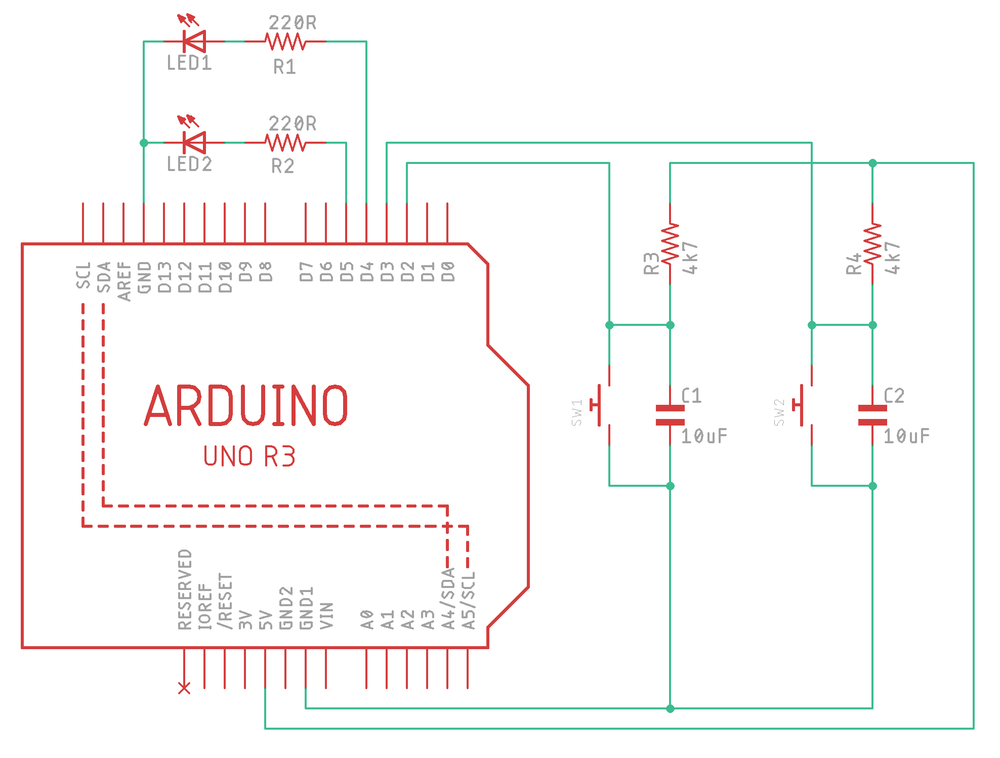

# Under PRESSure!

***Note:***  
*This game was created for an event in my school, in the midst of the event's trial run. There might be some inefficiencies or
"rough" implementation in the code as I had to quickly get the prototype up and running (and I had to implement GUI yet was completely
new to `tkinter`).*  

*Feel free to reuse and modify the codes for your own use (e.g. setting up the game for your event).*  

*And yes, the guide below is copy-pasted from the game description I wrote for the event.*

---

This is an incredibly simple Arduino-based game with Python GUI running on a computer.  
The Arduino board receives players' input and sends the data to over USB (serial) to the computer running the GUI. The computer (or
rather, the GUI) simply serves as a "scoreboard".

## How to Play
* Two groups compete in this game, with each group consisting of several participants (can be any number).
* There are two buttons, one for each group.
* The aim of this game is to **press a button as many times as possible in the given time**. The number of button presses and time left
is displayed on the monitor (connected to the computer running the GUI).
* The group with the most number of button presses win. The winner is "manually" named by the game master.  

**Rounds:**
* The game is divided into multiple rounds. Since there are only 2 buttons, only 1 person from each group will press their buttons
at a given round. Each round lasts for 5 seconds (configurable in code). Only during this 5 seconds can the players press the button;
the buttons are irresponsive after the time runs out.
* At the beginning of each round, the timer starts counting down right after one of the 2 players press the button.  

**Flow:**
* At the beginning of the game, the two groups queue up about 10 meters from the buttons, facing the button. Form **one queue for each
group**.
* When the round starts, the frontmost player in each queue spins in place for 10 rounds (to mess with their balance), after which they
rush towards their buttons to press it as fast as they can. The number of button presses is displayed on the monitor.
* As the timer is started by pressing one of the buttons, the first player to reach the buttons get to start the timer, thereby
reducing the other player's time for pressing his/her button. The faster a player reaches the button in advance of the other player,
the more advantage he/she has over that other player.
* After the time has elapsed, the buttons stop reacting to presses. The two players then return to their respective groups at the end
of the queue. **At the same time**, the next players (frontmost players of the groups) starts spinning in place, and the game proceeds
to the next round (and repeat).
* This can be repeated as many times as needed (to fill up time, or can be standardized). The number of button presses is cumulative.
* When the game ends (that is, game master decides to end the game), the winner is the group having the most number of button presses.
* Game master can then reset the scores using the reset button on the GUI.  

## Hardware
**Items needed:**
* Arduino Uno or other compatible boards (x1)
* USB cable, for connecting the Arduino board to PC (x1)
* Wire (about 6 meters)
* Jumper wires (or stripboard if wanna be tidy)
* Arcade buttons (x2, diameter: 6 cm)
* 10uF capacitors, for button debouncing (x2)
* 4.7k resistors, for button debouncing (x2)
* Personal computer, to run the Python GUI on (x1, can be a Raspberry Pi)
* Monitor + HDMI cable (x1)  

**Schematic:**

**Code Setup:**
* Upload the sketch to the Arduino board.
* Connect the Arduino to a PC that will run the GUI.
* On the same PC, open the Python script for the GUI, **modify** `ARDUINO_COM` constant to the correct port which the Arduino is
connected to (e.g.`ARDUINO_COM = 'COM18'`).
* Run the Python script to launch the GUI and start the game.
